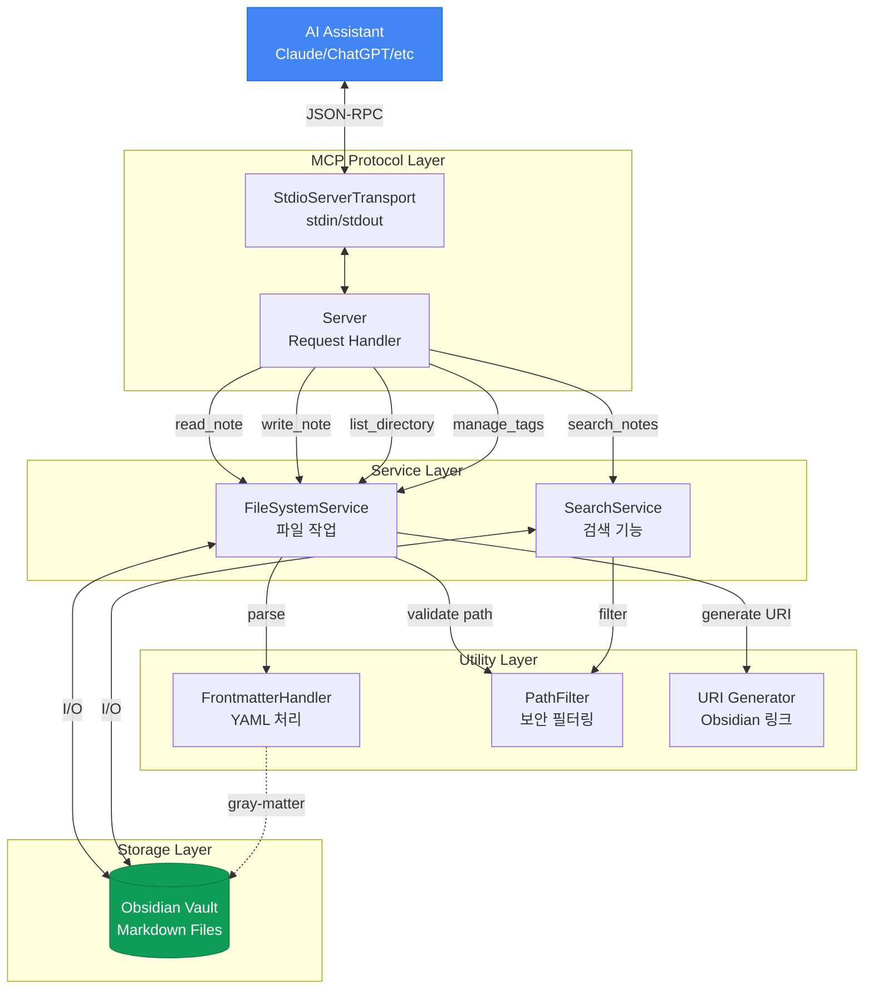

#### ◼️ 배경
- [[MCP-Obsidian/경량 Obsidian MCP 검색 기능 만들기(2) - 6억 개 파라미터를 200MB 안에 넣어보기]] 에서 임베딩 모델을 경량화 하여 도입하기에는 아직 기술적으로 어려움을 파악했다.
- 임베딩 방식이 아닌, 통계와 알고리즘을 통해 (1)Lightweight (2)Zero Dependency를 만족하는 검색기를 만들어 보자.
- 목표는 앞서 설정한 것과 동일하게, 다음 두 가지 케이스를 커버하는 것이다
	1. "검색 키워드를 노트가 포함한다"고 해서 보여주는 게 아니라, 그 중 가장 큰 관련성을 갖는 노트를 보여줘야 한다. (AI가 수십개의 노트를 하나하나 뒤져보다 토큰 사용량이 엄청 나오는 경우가 흔하다....)
	2. 옵시디언 노트들의 특성상, 오타 혹은 의미는 같지만 다른 표현("스프링부트" → "Spring", "스프링", "스프링 부트", "스프리ㅇ")들이 자주 나오기에, 이를 적절히 고려할 수 있어야 한다.

# 1. 조사: 전통적인 정보 검색 기법
- Retrieval을 수행하는 단계를 주로 `Candidate Generation`과 `Reranking`의 두 가지 Stage로 나눠 볼 수 있다.
	- 물론 `Candidate Generation`에서도 Ranker가 사용될 수 있다. (First-stage ranker라고 불리는 듯 하다.)
	- 둘의 차이는 그 목적에 있다. (방대한 데이터에서 후보를 뽑기 vs 추려진 후보들의 랭킹 정하기)
#### ◼️ 역색인 (Inverted Index)
- 빠른 탐색을 위해 사용한다.
- 일반적인 데이터 구조에서는 주소 P를 통해 정보 D를 찾는다.
- 역색인은 이 방향을 뒤집어, 정보 D를 통해 주소 P를 찾는다.
- 정보 검색에 활용할 때는 주로 문자열을 토큰 단위로 잘게 쪼개 Key($D$)로 활용한다.
#### ◼️ N-gram
- N-gram은 문자열을 크기 N의 슬라이딩 윈도우처럼 밀어가며 무식하게 자르는 방식이다.
	- e.g., `slice_n_gram("스프링부트", 2)` → `["스프", "프링", "링부", "부트"]`
- 때문에 오타나 표현의 차이가 있더라도 다른 부분들이 매칭되어 검색 결과에 포함될 수 있다.
	- e.g., `slice_n_gram("리팩토링", 2)` → `["리팩", "팩토", "토링"]` → `search("리팩터링")`
#### ◼️ BM25
- 통계 기반으로 관련성 스코어링의 정확도를 개선하기 위해 사용한다.
- 크게 세 가지 개념(TF, IDF, 문서 길이 정규화)에 기반한다.

$$score(D,Q)=i=1∑n​IDF(qi​)⋅f(qi​,D)+k1​⋅(1−b+b⋅avgdl∣D∣​)f(qi​,D)⋅(k1​+1)​
$$
- $f(q_i,D)$: 문서 $D$에서 용어 $q_i$가 등장한 횟수 (term frequency, TF)
- $|D|$: 문서 길이(토큰/단어 수)
- $avgdl$: 코퍼스 평균 문서 길이
- $k_1$​: TF 포화(saturation) 정도를 조절하는 파라미터 (관행적으로 1.2~2.0 많이 씀)
- $b$: 길이 정규화 강도(0~1). 관행적으로 0.75를 많이 씀
$$IDF(q)=ln(\frac{N−n(q)+0.5​}{n(q)+0.5}+1)$$
- $q$를 포함하는 문서가 적을 수록 $IDF(q)$는 커진다.
- $N$: 전체 문서 수
- $n(q)$: 용어 $q$를 포함하는 문서 수(document frequency)
###### TF (Term Frequency)
- 이름 그대로 단어의 빈도가 높을 수록 높은 점수를 매긴다.
- 문서 A에는 "스프링"이 3번 나오고, 문서 B에는 1번 나온다면 당연히 A가 B보다 "스프링"과 관련된 문서일 가능성이 높다.
- 단순히 등장 빈도에 따라 관련성이 선형적으로 증가하진 않는다. (수확체감의 법칙)
	- e.g., "스프링"이 10000번 언급된 문서 A가 1000번 언급된 문서 B보다 관련성이 10배 더 높다고 말하기는 어렵다. (둘 다 관련성이 높고, A가 B보다 조금 더 관련성이 높은 수준이다)
###### IDF (Inverse Document Frequency)
- 전체 문서(Vault)에서 자주 등장하는 단어는 가중치를 낮춘다.
- 예를 들어, "Numpy is a library" 라는 검색어에서 어떤 단어가 가장 중요할까?
	- 중요도 낮음: "is", "a" → 거의 모든 노트에서 사용됨
	- 중요도 보통: "library" → C++, Java, JS 등 다양한 노트에서 사용됨.
	- 중요도 높음: "Numpy" → Numpy와 관련된 노트에서만 사용됨.
- 전체 노트에서 각 단어의 출현 빈도를 측정한 후, 빈출 어휘는 IDF 값이 0에 수렴하여 점수에 영향을 주지 못하게 할 수 있다.
###### 문서 길이 정규화
- 단순히 문서에 검색어가 많이 나오는 것에서 더 나아가, 검색어가 포함된 밀도를 고려한다.
- 예를 들어, 노트 A에서는 "스프링"이 1번 나오고, 노트 B에서는 3번 나왔다고 하자.
	- 하지만 노트 A의 길이는 10줄 정도이고, 노트 B의 길이는 1000 줄이다.
	- 즉, 노트 A에서는 10줄마다 "스프링"이 1번 나오고, 노트 B에서는 10줄마다 "스프링"이 0.03회 나왔다.
	- 그렇다면 우리는 어떤 노트가 더 관련성이 높다고 판단해야 할까?
- BM25는 평균 문서 길이 대비 현재 문서의 길이를 계산하여, 불필요하게 긴 문서에 페널티를 부여한다.

# 2. 오픈소스 코드 분석
- mcp-obsidian의 코드는 다음과 같이 구성되어 있다. → 우리가 수정해야 할 부분은 `SearchService`다.



# 3. 벤치마크 방법 마련하기

#### ◼️ 데이터셋 선정
###### 데이터의 특성
- LLM이 MCP Search를 이용하는 것을 관찰하니, 주로 키워드 검색 용도로 사용하는 것을 확인했다.
- [[MCP-Obsidian/경량 Obsidian MCP 검색 기능 만들기(1) - 시작]] 에서 관찰됐던, LLM이 작성한 쿼리 길이는 1~2 단어였다.
###### 데이터셋 선정 및 전처리
- NFCorpus 데이터셋에서 단어 개수가 3개 이하인 쿼리 192개를 뽑아 사용했다.
- 본문 문서는 3,633개로 설정했다.
	- 2년간 사용한 내 Obsidian Vault의 문서가 1,500개 정도임을 감안하면, 적절히 많은 개수인 듯 하다.
- Obsidian 문서는 파일명을 제목으로 사용하므로, Obsidian에서 제목에 들어갈 수 없는 문자들과 중복 제목을 전처리하였다.

###### 기존 코드 벤치마크 점수 측정
```
{
	"algorithm": "substring",
	"corpusSize": 3633,
	"queryCount": 192,
	"ndcg": {
		"5": 0.2601289438576178,
		"10": 0.23679764131363143
	},
	"recall": {
		"5": 0.10354714456508278,
		"10": 0.11966417692998142
	},
	"mrr": {
		"5": 0.3766493055555556,
		"10": 0.38035920965608466
	},
	"latency": {
		"mean": 219.28459223958362,
		"p50": 225.39587500000198,
		"p95": 284.025999999998,
		"p99": 449.04366599999776
	},
	"durationMs": 42167.715542
}
```

# 4. 개선하기
## 4.1. Word 단위 검색
- 기존에는 쿼리 자체를 한 덩어리로 그대로 포함하는 것만 찾았기에, 관련성이 있는 문서도 찾지 못하는 경우가 있었다.
	- e.g., "Spring Batch" → "In Spring, we can make batch using its own library"와 매치 X


###### 결과
```
{
	"algorithm": "substring",
	"corpusSize": 3633,
	"queryCount": 192,
	"ndcg": {
		"5": 0.2093798721856485,
		"10": 0.1954508495177728
	},
	"recall": {
		"5": 0.0794052680904924,
		"10": 0.09804710734729562
	},
	"mrr": {
		"5": 0.31319444444444455,
		"10": 0.32204034391534403
	},
	"latency": {
		"mean": 168.09628062500002,
		"p50": 173.45566700000018,
		"p95": 417.4323340000001,
		"p99": 516.0667920000014
	},
	"durationMs": 32838.306749999996
}
```


## 4.2. BM25 Reranking 추가
- Word 단위 검색 시에는 부분 매칭 문서도 가져올 수는 있지만, 부작용으로는 너무 많은 문서가 불러와 져서 ndcg@k와 recall@k가 되려 악화된다. (많은 문서 중 k개 문서만 파일 순서대로 가져오기 때문에)
- 때문에 후보 문서들의 관련성을 평가한 뒤, 관련성에 따라 k개를 뽑는 reranking이 필요하다.
- 이 과정에서 널리 쓰이는 BM25 방식을 사용하였다.
###### 결과
- k1 = 1.2
```
{
	"algorithm": "substring",
	"corpusSize": 3633,
	"queryCount": 192,
	"ndcg": {
		"5": 0.3546763432051665,
		"10": 0.3237981884107521
	},
	"recall": {
		"5": 0.12511278614054228,
		"10": 0.14963792917669042
	},
	"mrr": {
		"5": 0.4964409722222222,
		"10": 0.5045324900793652
	},
	"latency": {
		"mean": 384.6275100052085,
		"p50": 322.3108750000001,
		"p95": 765.7581250000003,
		"p99": 1283.2154169999994
	},
	"durationMs": 74265.119458
}
```
- k1 = 1.5
```
{
	"algorithm": "substring",
	"corpusSize": 3633,
	"queryCount": 192,
	"ndcg": {
		"5": 0.35473324371779325,
		"10": 0.3237481106654526
	},
	"recall": {
		"5": 0.12464058587297577,
		"10": 0.14945468552140168
	},
	"mrr": {
		"5": 0.5009548611111111,
		"10": 0.5077959656084656
	},
	"latency": {
		"mean": 330.0705533593751,
		"p50": 307.6957910000001,
		"p95": 438.96887499999866,
		"p99": 847.1921249999999
	},
	"durationMs": 63448.081125
}
```
- k1 = 2.0
```
{
	"algorithm": "substring",
	"corpusSize": 3633,
	"queryCount": 192,
	"ndcg": {
		"5": 0.35823762653226426,
		"10": 0.32392710900255917
	},
	"recall": {
		"5": 0.12489979310654586,
		"10": 0.14920102386097434
	},
	"mrr": {
		"5": 0.5051215277777777,
		"10": 0.5114769345238095
	},
	"latency": {
		"mean": 334.06451803124986,
		"p50": 308.0958329999994,
		"p95": 467.2039590000022,
		"p99": 807.5830840000001
	},
	"durationMs": 64204.109833
}
```
- k1 = 2.5
```
{
	"algorithm": "substring",
	"corpusSize": 3633,
	"queryCount": 192,
	"ndcg": {
		"5": 0.3585463215032439,
		"10": 0.32443029783386507
	},
	"recall": {
		"5": 0.12489979310654586,
		"10": 0.14838391987291447
	},
	"mrr": {
		"5": 0.5055555555555556,
		"10": 0.5119109623015873
	},
	"latency": {
		"mean": 327.15274065104194,
		"p50": 309.2259170000034,
		"p95": 428.5856249999997,
		"p99": 768.443959
	},
	"durationMs": 62868.705582999995
}
```
- k1 = 3.0
```
{
	"algorithm": "substring",
	"corpusSize": 3633,
	"queryCount": 192,
	"ndcg": {
		"5": 0.36086319713455134,
		"10": 0.32438278763538575
	},
	"recall": {
		"5": 0.12529268794537532,
		"10": 0.14825126895901355
	},
	"mrr": {
		"5": 0.5107638888888889,
		"10": 0.5172433035714287
	},
	"latency": {
		"mean": 335.4102256979169,
		"p50": 302.7034999999996,
		"p95": 452.55929200000173,
		"p99": 1198.2282500000001
	},
	"durationMs": 64468.371708
}
```


결과 정리:                                                 
                                                             
  ┌─────┬────────┬─────────┬────────┐                        
  │ k1  │ NDCG@5 │ NDCG@10 │ MRR@5  │                        
  ├─────┼────────┼─────────┼────────┤                        
  │ 1.2 │ 0.3547 │ 0.3238  │ 0.4964 │                      
  ├─────┼────────┼─────────┼────────┤         
  │ 1.5 │ 0.3547 │ 0.3237  │ 0.5010 │
  ├─────┼────────┼─────────┼────────┤
  │ 2.0 │ 0.3582 │ 0.3239  │ 0.5051 │
  ├─────┼────────┼─────────┼────────┤
  │ 2.5 │ 0.3585 │ 0.3244  │ 0.5056 │
  ├─────┼────────┼─────────┼────────┤
  │ 3.0 │ 0.3609 │ 0.3244  │ 0.5108 │
  └─────┴────────┴─────────┴────────┘

  - k1을 올릴수록 NDCG@5, MRR@5가 미세하게 오른다.
  - 일반적인 k1 범위: 1.2~2.0. 대부분의 IR 라이브러리 기본값은 Lucene/Elasticsearch가 1.2, 학술 논문에서는 1.5를 많이 쓴다.


  k1의 역할: term frequency의 포화(saturation) 속도를        
  조절합니다.                                                
  - k1 작을수록 — TF가 빨리 포화. "한 번 나오나 열 번 나오나
  비슷" → 짧은 문서, 다양한 term이 골고루 나오는 게 유리
  - k1 클수록 — TF가 천천히 포화. "많이 나올수록 계속 점수
  올라감" → 긴 문서, 특정 주제를 깊게 다루는 문서가 유리

  오버피팅 가능성: 있습니다. NFCorpus는 의학 문서라 특정
  용어가 반복적으로 많이 등장하는 특성이 있어서, k1이 클수록
  그런 문서가 유리해진 걸 수 있습니다. 실제 옵시디언 vault는
  주제가 다양하고 문서 길이도 제각각이라 같은 경향이 나올
  거란 보장이 없습니다.

  차이 자체도 0.3547→0.3609로 미미하니, 범용적인 1.2로 두는
  게 안전합니다.


## 4.3. Full-word Matching을 우선시하기
- 사실 기존의 Full-Word Matching 방식에도 충분히 장점이 있었다.
- 예를 들어, "Spring Batch"를 검색했을 때, "Spring Batch is a library of Spring Framework"와 "Spring don't use batch to process it" 중 전자가 훨씬 더 관련성이 높다.
- 즉, "Full word"가 매칭된다면, 그 문서는 관련성이 높은 문서일 가능성이 높다.
- 또한 AI가 이미 문서의 내용을 알고 있으며, 문서의 특정 부분을 찾고 싶은 상황에서는 Full-Word Matching 방식이 훨씬 간단하고 좋다.

###### 구현
- 단순히 전체 텍스트를 terms에 추가해주는 것만으로도 해결 가능하다. 어차피 Full Text Matching 케이스는 적기 때문에, BM25의 IDF 로직에 따라 높은 점수를 획득할 수 있다.
```
const scoringTerms = terms.length > 1 ? [...terms, searchQuery] : terms;
```

###### 결과
- 오히려 점수가 근소하게 낮아졌다.
- 그러나 일부 유즈 케이스(AI가 이미 문서 내용을 모두 알고 있으며, 문장의 정확한 위치를 알고 싶을 때)에서는 이 로직 덕분에 정확히 해당 문장을 갖고 있는 문서가 다른 문서들을 제치고 첫 번째로 띄워줄 수 있다.
- 이 때문에 약간의 정확도 감소를 감수할 가치가 있다고 판단하였다.
```
{
	"algorithm": "substring",
	"corpusSize": 3633,
	"queryCount": 192,
	"ndcg": {
		"5": 0.3530929388442528,
		"10": 0.32136527881806237
	},
	"recall": {
		"5": 0.12510698705179688,
		"10": 0.14961678710194817
	},
	"mrr": {
		"5": 0.4934027777777777,
		"10": 0.5014942956349207
	},
	"latency": {
		"mean": 592.3298283333337,
		"p50": 478.9142499999871,
		"p95": 1141.7142910000002,
		"p99": 2326.9154169999965
	},
	"durationMs": 113814.441667
}
```

#### ◼️ 속도 개선하기
- 검색 로직을 강화하는 과정에서 쿼리 검색 소요 시간이 2배로 증가하였다. (234ms → 592ms)
- 기존에는 `limit` 인자로 들어온 개수만큼 문서가 수집되면 즉시 검색을 중단하고 반환했는데, PM25를 적용하며 항상 모든 문서를 읽다보니 생긴 문제로 보인다.

- 파트: fileRead (파일 I/O + frontmatter + toLowerCase)   
	- 시간: ~440ms                                            
	- 비율: ~80%                                                         
- 파트: docLength (split + filter로 단어 수 계산)
	- 시간: ~55ms                                             
	- 비율: ~10%                      
- 파트: match (term indexOf + filename 매칭)              
	- 시간: ~11ms                                             
	- 비율: ~2%                                                           
- 파트: DF (scoringTerms includes 체크)                   
	- 시간: ~10ms
	- 비율: ~2%
- 파트: findFiles (디렉토리 재귀 탐색)
	- 시간: ~6ms
	- 비율: ~1%
- 파트: candidate (excerpt, TF 카운트, push)
	- 시간: ~5ms
	- 비율: ~1%
- 파트: rerank (BM25 스코어링 + 정렬)
	- 시간: ~0.5ms
	- 비율: ~0%

- MCP 서버 실행 시 메모리에 올려두고 fs.watch로 캐시 무효화하며 관리하는 방법도 있지만, 상태 관리의 복잡성을 제어하기 힘들어 보였다.
- 때문에 단순하게 병렬 I/O를 통해, line을 5개씩 퍼올리는 방법으로 선택했다.
	- 5개인 이유는, 사용자에 따라 하나의 노트에 너무 많은 텍스트가 있는 경우 메모리 부담이 커질 수 있기 때문이다.
- 벤치마크 결과, 쿼리당 평균 소요시간이 63.6% 감소(592ms → 215ms)한 것을 확인할 수 있었다.
```
{
	"algorithm": "substring",
	"corpusSize": 3633,
	"queryCount": 192,
	"ndcg": {
		"5": 0.3530929388442528,
		"10": 0.32136527881806237
	},
	"recall": {
		"5": 0.12510698705179688,
		"10": 0.14961678710194817
	},
	"mrr": {
		"5": 0.4934027777777777,
		"10": 0.5014942956349207
	},
	"latency": {
		"mean": 215.34683502604176,
		"p50": 204.3982500000002,
		"p95": 269.2543750000041,
		"p99": 463.15758399999993
	},
	"durationMs": 41413.277375000005
	}
```

- 궁금해서 배치 사이즈를 10개, 50개로 키워서도 테스트했다.
- 배치 50개 기준, 쿼리당 평균 소요시간이 기존 대비 23.7% 감소(192ms→164ms)한 것을 확인하였다.

- 배치 사이즈 10개
```
{
	"algorithm": "substring",
	"corpusSize": 3633,
	"queryCount": 192,
	"ndcg": {
		"5": 0.3530929388442528,
		"10": 0.32136527881806237
	},
	"recall": {
		"5": 0.12510698705179688,
		"10": 0.14961678710194817
	},
	"mrr": {
		"5": 0.4934027777777777,
		"10": 0.5014942956349207
	},
	"latency": {
		"mean": 190.52729517708326,
		"p50": 175.54083300000093,
		"p95": 269.135041,
		"p99": 331.3311250000006
	},
	"durationMs": 36946.360250000005
}
```

- 배치 사이즈 50개
```
{
	"algorithm": "substring",
	"corpusSize": 3633,
	"queryCount": 192,
	"ndcg": {
		"5": 0.3530929388442528,
		"10": 0.32136527881806237
	},
	"recall": {
		"5": 0.12510698705179688,
		"10": 0.14961678710194817
	},
	"mrr": {
		"5": 0.4934027777777777,
		"10": 0.5014942956349207
	},
	"latency": {
		"mean": 164.80230489583326,
		"p50": 153.9827499999992,
		"p95": 196.74624999999833,
		"p99": 339.4449170000007
	},
	"durationMs": 31708.556167
}
```


- 그러나 결국  아래 이유로 기존 방식(배치 사이즈 5)을 쓰기로 결정했다.
	1. 배치 사이즈 5만 하더라도 충분히 빠르고
	2. 일부 md 파일이 굉장히 클 가능성을 완전히 배제할 수 없는데, (매우 드물지만) 파일 1개당 크기가 10MB일 때 배치 사이즈 5면 50MB 정도의 메모리를 차지하므로 납득할만한 수준이지만, 배치사이즈 50이면 500MB 정도의 메모리를 차지한다. → 큰 문제는 아니지만, 걱정해야 할 부분이 늘어난다.
		- 참고로 10MB의 마크다운 파일은 한글 300만 글자(장편 소설 10권 내외)에 해당한다.
		- 만약 로그 등 데이터가 우연치 않게 Vault에 포함돼 있으면, 메모리에 수GB의 텍스트가 올라와버리는 불상사가 생길 수 있다.
- 1, 2번을 종합했을 때, 배치 사이즈를 더 키움으로써 얻는 장점(속도 개선)이, 그로 인한 단점(걱정해야 할 부분이 늘어남)에 비해 너무 작다고 생각했다.


# 4. 최종 결과
- PR: https://github.com/bitbonsai/mcp-obsidian/pull/38

| Metric | Before | After | Change |
|--------|--------|-------|--------|
| NDCG@5 | 0.260 | 0.353 | **+35.7%** |
| NDCG@10 | 0.237 | 0.321 | **+35.7%** |
| MRR@5 | 0.377 | 0.493 | **+31.0%** |
| Recall@5 | 0.104 | 0.125 | +20.8% |
| Recall@10 | 0.120 | 0.150 | +25.0% |
| Latency (mean) | 219ms | 215ms | **-1.8%** |
