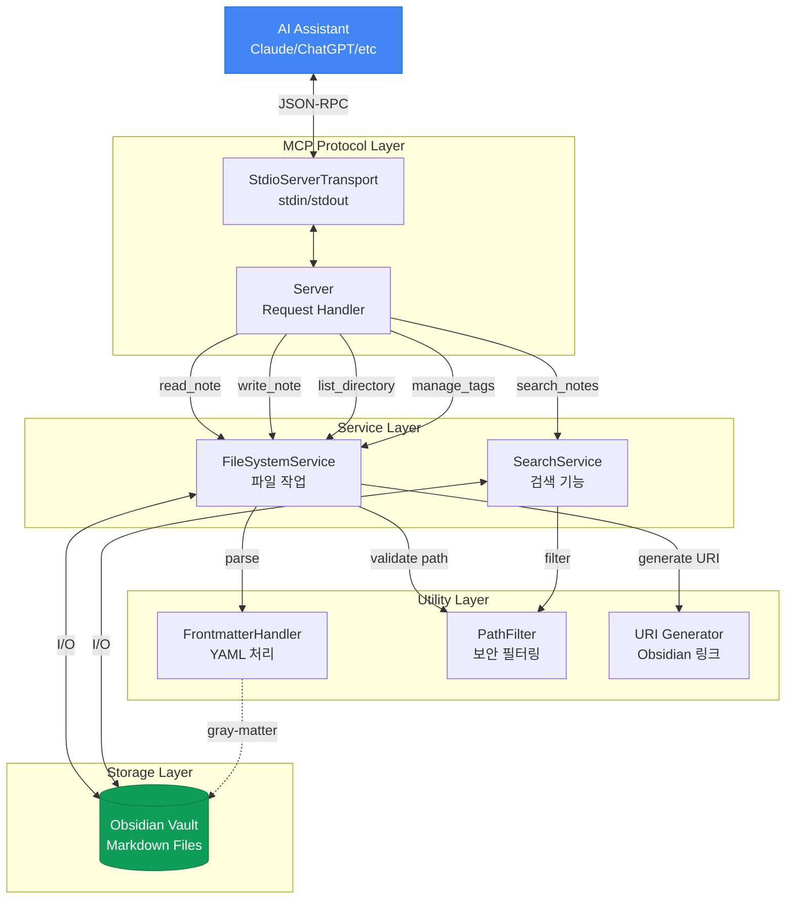

# 1. 배경
- [[경량 Obsidian MCP 검색 기능 만들기(2) - 6억 개 파라미터를 200MB 안에 넣어보기]] 에서 임베딩 모델을 경량화 하여 도입하기에는 아직 기술적으로 어려움을 파악했다.
- 임베딩 방식이 아닌, 통계와 알고리즘을 통해 (1)Lightweight (2)Zero Dependency를 만족하는 검색기를 만들어 보자.
- 목표는 앞서 설정한 것과 동일하게, 다음 두 가지 케이스를 커버하는 것이다
	1. "검색 키워드를 노트가 포함한다"고 해서 보여주는 게 아니라, 그 중 가장 큰 관련성을 갖는 노트를 보여줘야 한다. (AI가 수십개의 노트를 하나하나 뒤져보다 토큰 사용량이 엄청 나오는 경우가 흔하다....)
	2. 옵시디언 노트들의 특성상, 오타 혹은 의미는 같지만 다른 표현("스프링부트" → "Spring", "스프링", "스프링 부트", "스프리ㅇ")들이 자주 나오기에, 이를 적절히 고려할 수 있어야 한다.

# 2. 조사: BM25
- Retrieval을 수행하는 단계를 주로 `Candidate Generation`과 `Reranking`의 두 가지 Stage로 나눠 볼 수 있다.
	- 물론 `Candidate Generation`에서도 Ranker가 사용될 수 있다. (First-stage ranker라고 불리는 듯 하다.)
	- 둘의 차이는 그 목적에 있다. (방대한 데이터에서 후보를 뽑기 vs 추려진 후보들의 랭킹 정하기)
#### ◼️ BM25
- 통계 기반으로 관련성 스코어링의 정확도를 개선하기 위해 사용한다.
- 크게 세 가지 개념(TF, IDF, 문서 길이 정규화)에 기반한다.

$$
\mathrm{score}(D, Q)=\sum_{i=1}^{n} IDF(q_i)\cdot
\frac{f(q_i, D)\cdot (k_1+1)}
{f(q_i, D)+k_1\cdot\left(1-b+b\cdot\frac{|D|}{avgdl}\right)}
$$
- $f(q_i,D)$: 문서 $D$에서 용어 $q_i$가 등장한 횟수 (term frequency, TF)
- $|D|$: 문서 길이(토큰/단어 수)
- $avgdl$: 코퍼스 평균 문서 길이
- $k_1$​: TF 포화(saturation) 정도를 조절하는 파라미터 (관행적으로 1.2~2.0 많이 씀)
- $b$: 길이 정규화 강도(0~1). 관행적으로 0.75를 많이 씀
$$IDF(q)=ln(\frac{N−n(q)+0.5​}{n(q)+0.5}+1)$$
- $q$를 포함하는 문서가 적을 수록 $IDF(q)$는 커진다.
- $N$: 전체 문서 수
- $n(q)$: 용어 $q$를 포함하는 문서 수(document frequency)
###### TF (Term Frequency)
- 이름 그대로 단어의 빈도가 높을 수록 높은 점수를 매긴다.
- 문서 A에는 "스프링"이 3번 나오고, 문서 B에는 1번 나온다면 당연히 A가 B보다 "스프링"과 관련된 문서일 가능성이 높다.
- 단순히 등장 빈도에 따라 관련성이 선형적으로 증가하진 않는다. (수확체감의 법칙)
	- e.g., "스프링"이 10000번 언급된 문서 A가 1000번 언급된 문서 B보다 관련성이 10배 더 높다고 말하기는 어렵다. (둘 다 관련성이 높고, A가 B보다 조금 더 관련성이 높은 수준이다)
###### IDF (Inverse Document Frequency)
- 전체 문서(Vault)에서 자주 등장하는 단어는 가중치를 낮춘다.
- 예를 들어, "Numpy is a library" 라는 검색어에서 어떤 단어가 가장 중요할까?
	- 중요도 낮음: "is", "a" → 거의 모든 노트에서 사용됨
	- 중요도 보통: "library" → C++, Java, JS 등 다양한 노트에서 사용됨.
	- 중요도 높음: "Numpy" → Numpy와 관련된 노트에서만 사용됨.
- 전체 노트에서 각 단어의 출현 빈도를 측정한 후, 빈출 어휘는 IDF 값이 0에 수렴하여 점수에 영향을 주지 못하게 할 수 있다.
###### 문서 길이 정규화
- 단순히 문서에 검색어가 많이 나오는 것에서 더 나아가, 검색어가 포함된 밀도를 고려한다.
- 예를 들어, 노트 A에서는 "스프링"이 1번 나오고, 노트 B에서는 3번 나왔다고 하자.
	- 하지만 노트 A의 길이는 10줄 정도이고, 노트 B의 길이는 1000 줄이다.
	- 즉, 노트 A에서는 10줄마다 "스프링"이 1번 나오고, 노트 B에서는 10줄마다 "스프링"이 0.03회 나왔다.
	- 그렇다면 우리는 어떤 노트가 더 관련성이 높다고 판단해야 할까?
- BM25는 평균 문서 길이 대비 현재 문서의 길이를 계산하여, 불필요하게 긴 문서에 페널티를 부여한다.

# 3. 오픈소스 코드 분석
- mcp-obsidian의 코드는 다음과 같이 구성되어 있다. → 우리가 수정해야 할 부분은 `SearchService`다.



# 4. 벤치마크 방법 마련하기

#### ◼️ 데이터셋 선정
###### 데이터의 특성
- LLM이 MCP Search를 이용하는 것을 관찰하니, 주로 키워드 검색 용도로 사용하는 것을 확인했다.
- [[Project: MCP-Obsidian/경량 Obsidian MCP 검색 기능 만들기(1) - 시작]] 에서 관찰됐던, LLM이 작성한 쿼리 길이는 1~2 단어였다.
###### 데이터셋 선정 및 전처리
- NFCorpus 데이터셋에서 단어 개수가 3개 이하인 쿼리 192개를 뽑아 사용했다.
- 본문 문서는 3,633개로 설정했다.
	- 2년간 사용한 내 Obsidian Vault의 문서가 1,500개 정도임을 감안하면, 적절히 많은 개수인 듯 하다.
- Obsidian 문서는 파일명을 제목으로 사용하므로, Obsidian에서 제목에 들어갈 수 없는 문자들과 중복 제목을 전처리하였다.

###### 기존 코드 벤치마크 점수 측정
- 비교 기준: 초기 기준값(비교 대상 없음)

| 항목 | 값 |
|---|---|
| algorithm | substring |
| corpusSize | 3,633 |
| queryCount | 192 |

| Metric | 기존 코드 | 비교 대상 | 변화율 |
|---|---:|---:|---:|
| NDCG@5 | 0.2601 | - | - |
| NDCG@10 | 0.2368 | - | - |
| Recall@5 | 0.1035 | - | - |
| Recall@10 | 0.1197 | - | - |
| MRR@5 | 0.3766 | - | - |
| MRR@10 | 0.3804 | - | - |
| Latency mean (ms) | 219.2846 | - | - |
| Latency p50 (ms) | 225.3959 | - | - |
| Latency p95 (ms) | 284.0260 | - | - |
| Latency p99 (ms) | 449.0437 | - | - |
| Duration (ms) | 42167.7155 | - | - |

# 5. 개선하기
## 5.1. Word 단위 검색
- 기존에는 쿼리 자체를 한 덩어리로 그대로 포함하는 것만 찾았기에, 관련성이 있는 문서도 찾지 못하는 경우가 있었다.
	- e.g., "Spring Batch" → "In Spring, we can make batch using its own library"와 매치 X


###### 결과
- 비교 기준: 기존 코드 벤치마크(섹션 4)

| Metric | 기존 코드 | Word 단위 검색 | 변화율 |
|---|---:|---:|---:|
| NDCG@5 | 0.2601 | 0.2094 | -19.51% |
| NDCG@10 | 0.2368 | 0.1955 | -17.46% |
| Recall@5 | 0.1035 | 0.0794 | -23.31% |
| Recall@10 | 0.1197 | 0.0980 | -18.06% |
| MRR@5 | 0.3766 | 0.3132 | -16.85% |
| MRR@10 | 0.3804 | 0.3220 | -15.33% |
| Latency mean (ms) | 219.2846 | 168.0963 | -23.34% |
| Latency p50 (ms) | 225.3959 | 173.4557 | -23.04% |
| Latency p95 (ms) | 284.0260 | 417.4323 | +46.97% |
| Latency p99 (ms) | 449.0437 | 516.0668 | +14.93% |
| Duration (ms) | 42167.7155 | 32838.3067 | -22.12% |


## 5.2. BM25 Reranking 추가
- Word 단위 검색 시에는 부분 매칭 문서도 가져올 수는 있지만, 부작용으로는 너무 많은 문서가 불러와 져서 ndcg@k와 recall@k가 되려 악화된다. (많은 문서 중 k개 문서만 파일 순서대로 가져오기 때문에)
- 때문에 후보 문서들의 관련성을 평가한 뒤, 관련성에 따라 k개를 뽑는 reranking이 필요하다.
- 이 과정에서 널리 쓰이는 BM25 방식을 사용하였다.
###### 결과
- 비교 기준: 5.1 Word 단위 검색

| 설정 | NDCG@5 | 변화율 | NDCG@10 | 변화율 | Recall@10 | 변화율 | MRR@5 | 변화율 |
|---|---:|---:|---:|---:|---:|---:|---:|---:|
| k1=1.2 | 0.3547 | +69.39% | 0.3238 | +65.67% | 0.1496 | +52.62% | 0.4964 | +58.51% |
| k1=1.5 | 0.3547 | +69.42% | 0.3237 | +65.64% | 0.1495 | +52.43% | 0.5010 | +59.95% |
| k1=2.0 | 0.3582 | +71.09% | 0.3239 | +65.73% | 0.1492 | +52.17% | 0.5051 | +61.28% |
| k1=2.5 | 0.3585 | +71.24% | 0.3244 | +65.99% | 0.1484 | +51.34% | 0.5056 | +61.42% |
| k1=3.0 | 0.3609 | +72.35% | 0.3244 | +65.97% | 0.1483 | +51.20% | 0.5108 | +63.08% |

| 설정 | Latency mean (ms) | 변화율 | Latency p50 (ms) | 변화율 | Latency p95 (ms) | 변화율 | Latency p99 (ms) | 변화율 | Duration (ms) | 변화율 |
|---|---:|---:|---:|---:|---:|---:|---:|---:|---:|---:|
| k1=1.2 | 384.6275 | +128.81% | 322.3109 | +85.81% | 765.7581 | +83.44% | 1283.2154 | +148.65% | 74265.1195 | +126.15% |
| k1=1.5 | 330.0706 | +96.36% | 307.6958 | +77.39% | 438.9689 | +5.16% | 847.1921 | +64.17% | 63448.0811 | +93.21% |
| k1=2.0 | 334.0645 | +98.73% | 308.0958 | +77.62% | 467.2040 | +11.92% | 807.5831 | +56.49% | 64204.1098 | +95.52% |
| k1=2.5 | 327.1527 | +94.62% | 309.2259 | +78.27% | 428.5856 | +2.67% | 768.4440 | +48.90% | 62868.7056 | +91.45% |
| k1=3.0 | 335.4102 | +99.53% | 302.7035 | +74.51% | 452.5593 | +8.42% | 1198.2283 | +132.19% | 64468.3717 | +96.32% |

- k1을 올릴수록 NDCG@5, MRR@5가 미세하게 오른다.
- 일반적인 k1 범위: 1.2~2.0. 대부분의 IR 라이브러리 기본값은 Lucene/Elasticsearch가 1.2, 학술 논문에서는 1.5를 많이 쓴다.

k1의 역할: term frequency의 포화(saturation) 속도를 조절한다.
- k1 작을수록 TF가 빨리 포화되어, 짧은 문서나 다양한 term이 고르게 나오는 문서가 유리하다.
- k1 클수록 TF가 천천히 포화되어, 긴 문서나 특정 주제를 깊게 다루는 문서가 유리하다.
- 오버피팅 가능성: NFCorpus는 의학 문서라 반복 용어 특성이 강해 k1이 큰 쪽이 유리해졌을 수 있다.
- 차이 자체가 미미하니(예: NDCG@5 0.3547 → 0.3609), 범용값 1.2를 쓰는 판단이 합리적이다.


## 5.3. Full-word Matching을 우선시하기
- 사실 기존의 Full-Word Matching 방식에도 충분히 장점이 있었다.
- 예를 들어, "Spring Batch"를 검색했을 때, "Spring Batch is a library of Spring Framework"와 "Spring don't use batch to process it" 중 전자가 훨씬 더 관련성이 높다.
- 즉, "Full word"가 매칭된다면, 그 문서는 관련성이 높은 문서일 가능성이 높다.
- 또한 AI가 이미 문서의 내용을 알고 있으며, 문서의 특정 부분을 찾고 싶은 상황에서는 Full-Word Matching 방식이 훨씬 간단하고 좋다.

###### 구현
- 단순히 전체 텍스트를 terms에 추가해주는 것만으로도 해결 가능하다. 어차피 Full Text Matching 케이스는 적기 때문에, BM25의 IDF 로직에 따라 높은 점수를 획득할 수 있다.
```
const scoringTerms = terms.length > 1 ? [...terms, searchQuery] : terms;
```

###### 결과
- 오히려 점수가 근소하게 낮아졌다.
- 그러나 일부 유즈 케이스(AI가 이미 문서 내용을 모두 알고 있으며, 문장의 정확한 위치를 알고 싶을 때)에서는 이 로직 덕분에 정확히 해당 문장을 갖고 있는 문서가 다른 문서들을 제치고 첫 번째로 띄워줄 수 있다.
- 이 때문에 약간의 정확도 감소를 감수할 가치가 있다고 판단하였다.
- 비교 기준: BM25 Reranking (k1=1.2)

| Metric | BM25 k1=1.2 | Full-word 우선 | 변화율 |
|---|---:|---:|---:|
| NDCG@5 | 0.3547 | 0.3531 | -0.45% |
| NDCG@10 | 0.3238 | 0.3214 | -0.75% |
| Recall@5 | 0.1251 | 0.1251 | -0.00% |
| Recall@10 | 0.1496 | 0.1496 | -0.01% |
| MRR@5 | 0.4964 | 0.4934 | -0.61% |
| MRR@10 | 0.5045 | 0.5015 | -0.60% |
| Latency mean (ms) | 384.6275 | 592.3298 | +54.00% |
| Latency p50 (ms) | 322.3109 | 478.9142 | +48.59% |
| Latency p95 (ms) | 765.7581 | 1141.7143 | +49.10% |
| Latency p99 (ms) | 1283.2154 | 2326.9154 | +81.33% |
| Duration (ms) | 74265.1195 | 113814.4417 | +53.25% |

## 5.4. 속도 개선하기
- 검색 로직을 강화하는 과정에서 쿼리 검색 소요 시간이 2배로 증가하였다. (234ms → 592ms)
- 기존에는 `limit` 인자로 들어온 개수만큼 문서가 수집되면 즉시 검색을 중단하고 반환했는데, BM25를 적용하며 항상 모든 문서를 읽다 보니 생긴 문제로 보인다.

| 파트 | 설명 | 시간 | 비율 |
|---|---|---:|---:|
| fileRead | 파일 I/O + frontmatter + toLowerCase | ~440ms | ~80% |
| docLength | split + filter로 단어 수 계산 | ~55ms | ~10% |
| match | term indexOf + filename 매칭 | ~11ms | ~2% |
| DF | scoringTerms includes 체크 | ~10ms | ~2% |
| findFiles | 디렉토리 재귀 탐색 | ~6ms | ~1% |
| candidate | excerpt, TF 카운트, push | ~5ms | ~1% |
| rerank | BM25 스코어링 + 정렬 | ~0.5ms | ~0% |

- MCP 서버 실행 시 메모리에 올려두고 fs.watch로 캐시 무효화하며 관리하는 방법도 있지만, 상태 관리의 복잡성을 제어하기 힘들어 보였다.
- 때문에 단순하게 병렬 I/O를 통해, line을 5개씩 퍼올리는 방법으로 선택했다.
	- 5개인 이유는, 사용자에 따라 하나의 노트에 너무 많은 텍스트가 있는 경우 메모리 부담이 커질 수 있기 때문이다.
- 벤치마크 결과, 쿼리당 평균 소요시간이 63.6% 감소(592ms → 215ms)한 것을 확인할 수 있었다.
- 비교 기준: Full-word 우선 적용 직후(배치 처리 전)

| 설정 | NDCG@5 | 변화율 | NDCG@10 | 변화율 | Recall@10 | 변화율 | MRR@5 | 변화율 |
|---|---:|---:|---:|---:|---:|---:|---:|---:|
| 배치 5 | 0.3531 | +0.00% | 0.3214 | +0.00% | 0.1496 | +0.00% | 0.4934 | +0.00% |
| 배치 10 | 0.3531 | +0.00% | 0.3214 | +0.00% | 0.1496 | +0.00% | 0.4934 | +0.00% |
| 배치 50 | 0.3531 | +0.00% | 0.3214 | +0.00% | 0.1496 | +0.00% | 0.4934 | +0.00% |

| 설정    | Latency mean (ms) |     변화율 | Latency p50 (ms) |     변화율 | Latency p95 (ms) |     변화율 | Latency p99 (ms) |     변화율 | Duration (ms) |     변화율 |
| ----- | ----------------: | ------: | ---------------: | ------: | ---------------: | ------: | ---------------: | ------: | ------------: | ------: |
| 배치 5  |          215.3468 | -63.64% |         204.3983 | -57.32% |         269.2544 | -76.42% |         463.1576 | -80.10% |    41413.2774 | -63.61% |
| 배치 10 |          190.5273 | -67.83% |         175.5408 | -63.35% |         269.1350 | -76.43% |         331.3311 | -85.76% |    36946.3603 | -67.54% |
| 배치 50 |          164.8023 | -72.18% |         153.9827 | -67.85% |         196.7462 | -82.77% |         339.4449 | -85.41% |    31708.5562 | -72.14% |

- 궁금해서 배치 사이즈를 10개, 50개로 키워서도 테스트했다.
- 배치 50개 기준, 쿼리당 평균 소요시간이 기존 대비 23.7% 감소(192ms→164ms)한 것을 확인하였다.


- 그러나 결국 아래 이유로 기존 방식(배치 사이즈 5)을 쓰기로 결정했다.
	1. 배치 사이즈 5만 하더라도 충분히 빠르고
	2. 일부 md 파일이 굉장히 클 가능성을 완전히 배제할 수 없는데, (매우 드물지만) 파일 1개당 크기가 10MB일 때 배치 사이즈 5면 50MB 정도의 메모리를 차지하므로 납득할만한 수준이지만, 배치사이즈 50이면 500MB 정도의 메모리를 차지한다. → 큰 문제는 아니지만, 걱정해야 할 부분이 늘어난다.
		- 참고로 10MB의 마크다운 파일은 한글 300만 글자(장편 소설 10권 내외)에 해당한다.
		- 만약 로그 등 데이터가 우연치 않게 Vault에 포함돼 있으면, 메모리에 수GB의 텍스트가 올라와버리는 불상사가 생길 수 있다.
- 1, 2번을 종합했을 때, 배치 사이즈를 더 키움으로써 얻는 장점(속도 개선)이, 그로 인한 단점(걱정해야 할 부분이 늘어남)에 비해 너무 작다고 생각했다.


# 6. 최종 결과
- PR: https://github.com/bitbonsai/mcp-obsidian/pull/38

| Metric         | Before | After | Change     |
| -------------- | ------ | ----- | ---------- |
| NDCG@5         | 0.260  | 0.353 | **+35.7%** |
| NDCG@10        | 0.237  | 0.321 | **+35.7%** |
| MRR@5          | 0.377  | 0.493 | **+31.0%** |
| Recall@5       | 0.104  | 0.125 | +20.8%     |
| Recall@10      | 0.120  | 0.150 | +25.0%     |
| Latency (mean) | 219ms  | 215ms | **-1.8%**  |
